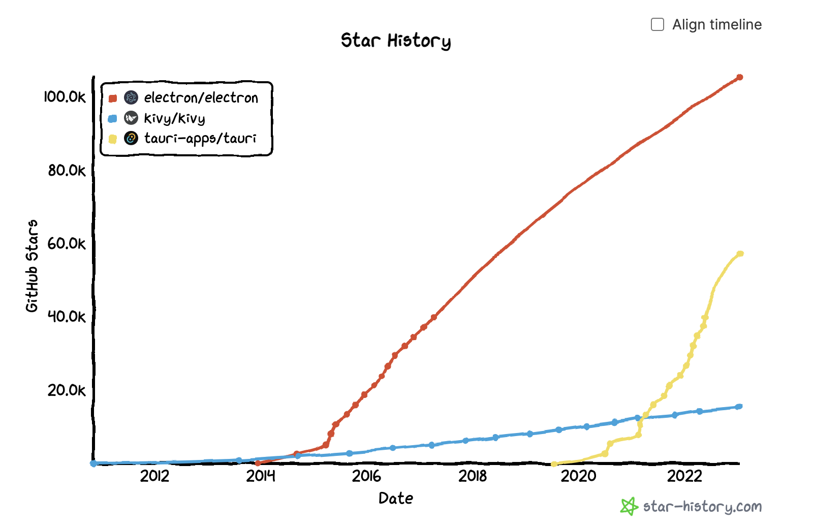

你好，xxx

关于近期跨平台桌面端项目选型的问题，调研结果如下：

|        | [PyQt](https://riverbankcomputing.com/software/pyqt/intro)  | [Kivy](https://github.com/kivy/kivy)  | [Electron](https://github.com/electron/electron)  | [Tauri](https://github.com/tauri-apps/tauri/)  |
|  ----  | ----  | ----  | ----  | ----  |
| 语言  | Python | kV language + Python | Javascript | Rust + Javascript |
| UI  | 现成基础组件库，定制能力强但耗时 | 现成基础组件库，kV language设计 | 现成web前端，现代化设计 | 现成web前端，现代化设计 |
| 性能  | 极好 | 较好 | 较差 | 好 |
| 包大小  | 一般 | 一般 | 很大，包含浏览器内核 | 较小，内嵌python后变大 |
| 能否运行python算法  | 可内嵌 | 可内嵌 | 不可内嵌，需通过子进程或单独的python服务调用对应算法 | 可内嵌（[Sidecar](https://tauri.app/v1/guides/building/sidecar/)） |
| 数据可视化分析  | 可以实现，交互实现需深入评估 | 未知 | 前端社区既有方案 | 前端社区既有方案 |
| 插件机制  | 可实现 | 可实现 | 可实现 | 可实现 |
| 关注度  | 未知 ||  |
| License  | [GPL and Riverbank Commercial](https://www.riverbankcomputing.com/static/Docs/PyQt6/introduction.html#license) | [MIT](https://github.com/kivy/kivy/blob/master/LICENSE) | [MIT](https://github.com/electron/electron/blob/main/LICENSE) | [Apache-2.0](https://github.com/tauri-apps/tauri/blob/dev/LICENSE_APACHE-2.0), [MIT](https://github.com/tauri-apps/tauri/blob/dev/LICENSE_MIT) |
| 风险  | 许可证及现代UI设计，后续数据交互展示难题，热更新问题 | 现代UI设计，数据交互展示难题，kv language学习，热更新问题 | 包大小及性能问题 | Rust学习曲线，内嵌模型二进制文件可行性探索 |

由于历史及生态建设原因，许多一流的数据处理及数学库都以Python编写（Tensorflow、Numpy、Scipy、Pandas），而成熟、可交互的数据可视化开源方案以JS编写为主（D3,Three.js, Echarts或antv体系）。基于Python可视化库（如：matplotlib、Seaborn、plotnine等）再实现一套可行的交互体系，理论上可行，然而鉴于我们项目以辅助科研数据分析为主，是否需要投入大精力在基础轮子的实现上，值的商榷。

在上述四种方案对比中，Tauri作为近两年新秀表现无疑十分抢眼，其[Roadmap](https://tauri.app/)提及以Python作为后台语言的可能性，无疑将进一步简化Python+Tauri的集成。当然，Python社区也有不少其他方案，如[Eel](https://github.com/python-eel/Eel),[pywebview](https://github.com/r0x0r/pywebview)等，虽然其关注度不算高，但也有进一步探索的可能。

综上，将数据分析及数据展示分开是较为合适的（后台与前端分离，使框架间的迁移成为可能）。前端数据可视化社区已有许多成熟的方案，足以应对绝大多数需求。好的数据分析往往需要一定的探索，而体验良好的交互过程无疑将提高这一探索效率，在这点上前端方案拥有既成的优势。

谢谢
Mark