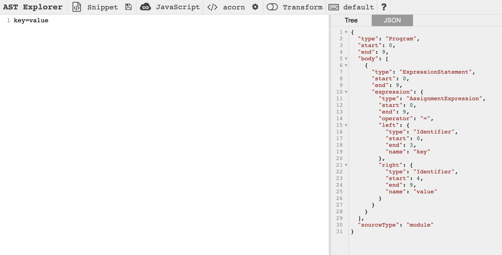

a. 该方案实现查询语句的自动补全主要包含两个模块：
1. 通过[antlr4ts](https://github.com/tunnelvisionlabs/antlr4ts)进行词法分析及语法解析生成parse tree（AST跟parse tree其实有区别，不过作者文中并未深究），识别用户正在输入的是key、value还是其他情况；
2. 通过[CodeMirror](https://github.com/codemirror/codemirror5)实现用户查询语句输入的文本框及智能提示弹窗。 

简单来说，该方案就是参考编译原理，在parse tree生成后，遍历其节点确定用户当前输入所处的节点类型，利用fetchSuggestions函数向后端发送请求（key或value），然后将返回值存放于组件suggestionsInfo状态。并通过第三方组件[CodeMirror](https://github.com/codemirror/codemirror5)及其[showHint Addon](https://codemirror.net/5/doc/manual.html#addon_show-hint)达到给用户输入自动补全的目的。

注：关于词法分析(Lexer)及语法解析(Parser)写法相关内容，参见[文档](https://github.com/antlr/antlr4/blob/master/doc/index.md)。另外作者提供的[源码](https://github.com/slepowronski/autocomplete/blob/master/src/services/suggestionsNetwork.service.ts)中，fetchSuggestions仅在前端进行模拟，并未实际发送请求，但其表达的意思如此。

***

b. 如a中所述，模块二仅为前端展示，替代与否于整体影响不大。故下述调研结果主要针对模块一：
1. 如果查询语句的语法满足[ESTree spec](https://github.com/estree/estree)，大可采用[acorn](https://github.com/acornjs/acorn/tree/master/acorn/)或[babel-parser](https://github.com/babel/babel/tree/main/packages/babel-parser)等现成的解析器，通过解析出的AST来判断所在位置及发送请求；
2. 记录用户查询历史，搜索查询的历史推荐用户查询的提示；
3. 针对所收集的用户成功发起查询的语句记录，训练模型，参见[文章](https://medium.com/geekculture/auto-code-generation-using-gpt-2-4e81cb05430)。  

***

## 补充：  

首先需要明确的是：antlr仅用于解析字符串确定正在输入的是什么，而[输入建议](https://github.com/slepowronski/autocomplete/blob/master/src/services/suggestionsNetwork.service.ts)则源于将 **正在输入的相关信息** 传给后端，API返回相应建议（作者在前端进行了模拟）。    

本文作者举了个"key=value"的简单例子，刚好满足[ESTree spec](https://github.com/estree/estree)，即可使用常见的JS解析器（[acorn](https://github.com/acornjs/acorn/tree/master/acorn/)、[babel-parser](https://github.com/babel/babel/tree/main/packages/babel-parser)主要用于webpack，rollup等JS打包工具，此类工具通常需要将JS文件解析成AST后再进行一系列转化处理）。具体转化可参考[在线工具](https://astexplorer.net/),结果如下图。

  
当然，这个方法比较局限，仅适用于恰好满足的情形。如果真要寻找类似于antlr这种通用的语法分析器，[jison](https://github.com/zaach/jison)也不失为另一种选择吧。  

另外两点是直接将字符串发往后端进行推荐搜索，以后端实现为主，与上述在前端内置语法分析器做法差距较大，但也不失为可探索方向。